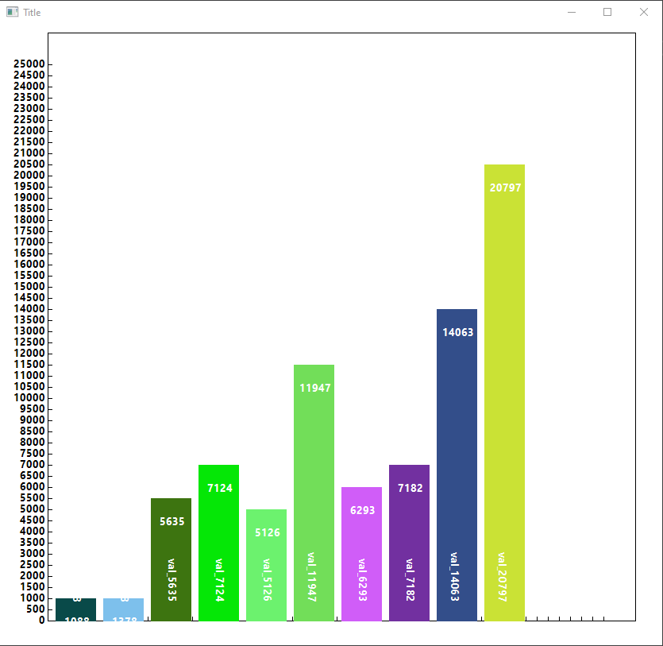

# ChartLib

### Charting cpp lib for Windows
  
Simple [GDI+](https://learn.microsoft.com/en-us/windows/win32/api/gdiplusheaders/) wrapper for drawing charts.

## 📊 Screenshots

<div align="center">
<div>

</div>
</div>

## 📖 Features

- 📐 Draw coordinates grid.
- 📊 Draw bars.

## 📑 Roadmap

- [ ] Support for line charts
- [ ] Support for circular diagram
- [ ] Resizable grid
- [ ] Custom chart legend

## Build
- Visual Studio 2022

## Usage

Initialize GDI in `WinMain`.  
```cpp
GDI_service  gdi;
gdi.initGDI();
```
Add resource cleanup before closing the application
```cpp
gdi.shutdownGDI();
```
Initialize drawing with a handle to a device context ([HDC](https://learn.microsoft.com/en-us/windows/win32/api/winuser/nf-winuser-getdc))
```cpp
gdi.initDrawing(hdc);
```
Create and initialize [`chart_grid`](https://github.com/bexolder2/ChartLib/blob/master/ChartLib/src/utils/chart_grid.h) structure. You can specify segment value, maximum value and chart size. To disable X-coordinates labels set `disable_x_labels` flag to `true` in `drawCoordinateGrid`.
```cpp
chart_grid chart_settings = { 500, 25000, Rect(60, 10, 740, 740) };
gdi.drawCoordinateGrid(chart_settings);
```
Initialize [`bar_collection`](https://github.com/bexolder2/ChartLib/blob/master/ChartLib/src/utils/bar_item.h) structure and use `drawBars` method to render the bars.

```cpp
bar_collection bars;	
for (int i = 0; i < 10; ++i)
{
	Color c(0 + (rand() % 255), 0 + (rand() % 255), 0 + (rand() % 255));
	bar_item item;
	item.value = 500 + (rand() % 25000);
	item.label = L"val_" + std::to_wstring(item.value);
	item.pen = new Pen{ c };
	item.brush = new SolidBrush{ c };
	bars.items.push_back(item);
}

gdi.drawBars(bars);
```

A complete sample is available [here](https://github.com/bexolder2/ChartLib/blob/master/ChartLib.Sample/Source.cpp).
